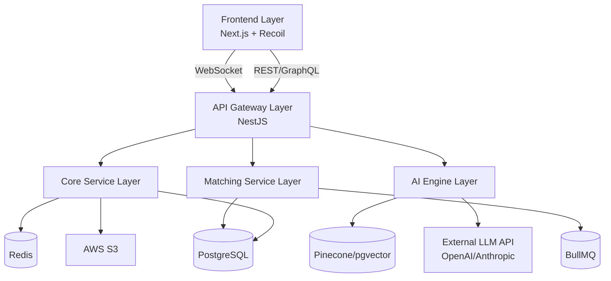

# System Architecture

**Document:** TailCamp PRD - System Architecture  
**Version:** 2.0  
**Last Updated:** 2025-11-28  

---

## 1. Overview

This document outlines the high-level system architecture of TailCamp (OpusNode), detailing the responsibilities of each layer and their interactions. The architecture is designed to be **scalable**, **modular**, and **resilient**, supporting real-time collaboration and AI-driven features. It adopts a **Microservices-ready Monolith** pattern to balance initial development speed with future scalability.

**Related Documents:**
- [02-Technology-Stack](02-Technology-Stack.md)
- [03-Database-Schema](03-Database-Schema.md)
- [04-API-Endpoints](04-API-Endpoints.md)

---

## 2. High-Level Architecture

## 3. Architecture Layers

### 3.1 Frontend Layer
**Responsibility:**
-   Delivers the user interface and experience using **Next.js (App Router)**.
-   Manages client-side state (Recoil/Zustand) and server state (TanStack Query).
-   Handles real-time updates via **Socket.io Client** for chat and notifications.

**Key Components:**
-   **Next.js App Router:** Server-side rendering (SSR) for SEO and initial load performance.
-   **Global State:** Recoil or Zustand for managing user sessions and UI state.
-   **WebSocket Client:** Establishes persistent connections for real-time collaboration features.

### 3.2 API Gateway Layer
**Responsibility:**
-   Acts as the single entry point for all client requests, enforcing security and routing.
-   Handles **Authentication (JWT)**, **Rate Limiting**, and **Request Validation**.
-   Aggregates responses from underlying services to minimize client round-trips.

**Key Components:**
-   **NestJS:** Provides a structured, scalable server-side framework.
-   **GraphQL (Apollo):** Enables flexible data fetching for complex views (e.g., Dashboards).
-   **Passport.js:** Middleware for handling OAuth and JWT strategies.

### 3.3 Core Service Layer
**Responsibility:**
-   Executes primary business logic and enforces domain rules.
-   Manages the lifecycle of Users, Groups, Projects, and Curriculums.
-   Ensures data integrity through ACID transactions.

**Key Services:**
-   **User Service:** Manages profiles, authentication, and role-based access control (RBAC).
-   **Group Service:** Handles team formation, member management, and group settings.
-   **Project Service:** Manages project workspaces, tasks, and integration webhooks.
-   **Curriculum Service:** Generates and tracks personalized learning paths.

### 3.4 AI Engine Layer
**Responsibility:**
-   Orchestrates AI workflows for **Skill Assessment** and **Content Generation**.
-   Manages context windows and prompt engineering to optimize LLM performance.
-   Interfaces with external LLM providers (OpenAI, Anthropic) securely.

**Key Components:**
-   **LangChain:** Framework for chaining LLM calls and managing memory.
-   **Vector Store (Pinecone/pgvector):** Stores embeddings for semantic search of curriculum content.
-   **LLM API:** External APIs for text generation and code analysis.

### 3.5 Matching Service Layer
**Responsibility:**
-   Processes the user queue to form optimal groups based on defined criteria.
-   Calculates compatibility scores using **Cosine Similarity** and heuristic algorithms.
-   Manages real-time notifications for match events via **Redis Pub/Sub**.

**Key Components:**
-   **Python Microservice (FastAPI):** Handles heavy mathematical computations for matching.
-   **Scikit-learn:** Library for implementing similarity and clustering algorithms.
-   **Redis Queue (BullMQ):** Manages asynchronous matching jobs to prevent blocking the main thread.

### 3.6 Data & Storage Layer
**Responsibility:**
-   Persists application data securely and reliably.
-   Provides caching mechanisms to reduce database load.
-   Stores unstructured data like user uploads and generated portfolios.

**Key Components:**
-   **PostgreSQL:** Primary relational database for structured data.
-   **Redis:** In-memory store for caching sessions and managing job queues.
-   **AWS S3:** Object storage for files, images, and PDF exports.

## 4. Cross-Cutting Concerns

### 4.1 Security
-   **Authentication:** JWT-based stateless authentication with refresh tokens.
-   **Authorization:** Role-Based Access Control (RBAC) for Admin, Instructor, and Student roles.
-   **Data Protection:** Encryption at rest (AES-256) and in transit (TLS 1.3). PII masking before sending data to AI models.

### 4.2 Scalability
-   **Horizontal Scaling:** Stateless API services deployed via Docker containers (ECS/Kubernetes).
-   **Database Scaling:** Read replicas for PostgreSQL to handle high read volumes.
-   **Caching Strategy:** Aggressive caching of static content and frequent queries using Redis.

### 4.3 Observability
-   **Logging:** Centralized logging (ELK Stack or CloudWatch) for troubleshooting.
-   **Monitoring:** Real-time metrics (Prometheus/Grafana) for system health (CPU, Memory, Latency).
-   **Tracing:** Distributed tracing (OpenTelemetry) to identify bottlenecks in microservices.

