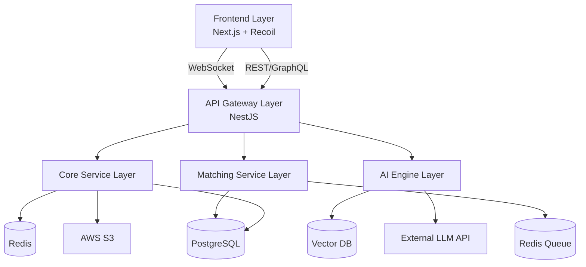

# System Architecture

**Document:** TailCamp PRD - System Architecture  
**Version:** 1.2  
**Last Updated:** 2025-11-23

---

## 1. Overview

This document outlines the high-level system architecture of TailCamp, detailing the responsibilities of each layer and their interactions. The architecture is designed to be scalable, modular, and resilient, supporting real-time collaboration and AI-driven features.

**Related Documents:**
- [Technology Stack](technology-stack.md)
- [Database Schema](database-schema.md)
- [API Endpoints](api-endpoints.md)

---

## 2. High-Level Architecture

## 3. Architecture Layers

### 3.1 Frontend Layer
**Responsibility:**
-   Delivers the user interface and experience.
-   Manages client-side state and routing.
-   Handles real-time updates via WebSocket.

**Key Components:**
-   **Next.js App Router:** Server-side rendering and routing.
-   **Recoil/Zustand:** Global state management.
-   **WebSocket Client:** Real-time communication for chat and notifications.

### 3.2 API Gateway Layer
**Responsibility:**
-   Acts as the single entry point for all client requests.
-   Handles authentication, rate limiting, and request routing.
-   Aggregates responses from underlying services.

**Key Components:**
-   **NestJS:** Server-side framework.
-   **GraphQL (Apollo):** Flexible data fetching.
-   **Passport.js:** Authentication middleware.

### 3.3 Core Service Layer
**Responsibility:**
-   Executes primary business logic.
-   Manages user data, groups, projects, and curriculums.
-   Ensures data integrity and validation.

**Key Services:**
-   **User Service:** Profile and auth management.
-   **Group Service:** Team management and coordination.
-   **Project Service:** Task and workspace logic.
-   **Curriculum Service:** Learning path management.

### 3.4 AI Engine Layer
**Responsibility:**
-   Orchestrates AI workflows for assessment and content generation.
-   Manages context and prompt engineering.
-   Interfaces with external LLM providers.

**Key Components:**
-   **LangChain:** LLM orchestration framework.
-   **Vector Store:** Semantic search for curriculum content.
-   **LLM API:** OpenAI GPT-4 / Claude 3.5.

### 3.5 Matching Service Layer
**Responsibility:**
-   Processes the user queue to form optimal groups.
-   Calculates compatibility scores (Cosine Similarity).
-   Manages real-time notifications for match events.

**Key Components:**
-   **Python FastAPI:** High-performance calculation service.
-   **Scikit-learn:** Similarity algorithms.
-   **Redis:** In-memory queue management.

### 3.6 Data & Storage Layer
**Responsibility:**
-   Persists application data and assets.
-   Provides caching for performance.

**Key Components:**
-   **PostgreSQL:** Primary relational database.
-   **Redis:** Caching and Pub/Sub.
-   **Milvus/Pinecone:** Vector database for AI embeddings.
-   **AWS S3:** Object storage for user uploads and portfolios.

## 4. Data Flow Examples

### Assessment Flow
1.  **User Input:** User submits an answer via Frontend.
2.  **Gateway:** Authenticates request and forwards to AI Engine.
3.  **AI Engine:** Analyzes answer using LLM, updates context in Vector DB.
4.  **Response:** Returns next question or final result to Frontend.

### Matching Flow
1.  **Join Queue:** User requests matching; added to Redis Queue via Matching Service.
2.  **Processing:** Cron job triggers matching algorithm (Python).
3.  **Formation:** Algorithm identifies optimal group; updates PostgreSQL.
4.  **Notification:** Matching Service publishes event to Redis Pub/Sub; Gateway pushes to Client via WebSocket.

## 5. Security Architecture

### Authentication & Authorization
-   **JWT:** Stateless authentication tokens.
-   **RBAC:** Role-based access control (User, Admin, Moderator).
-   **MFA:** Multi-factor authentication for sensitive accounts (optional).

### Data Security
-   **Encryption:** TLS 1.3 for data in transit; AES-256 for sensitive data at rest.
-   **Sanitization:** Input validation to prevent SQL Injection and XSS.

*Refer to [Security & Privacy](../09-security/security-privacy.md) for details.*

## 6. Scalability Strategy

-   **Stateless Services:** API and Core services can be horizontally scaled behind a load balancer.
-   **Read Replicas:** PostgreSQL read replicas for heavy read operations.
-   **Caching:** Aggressive caching of static content and curriculum data in Redis.
-   **Async Processing:** Heavy tasks (e.g., Portfolio generation) offloaded to background workers.

---

**Next Step:** Review [Technology Stack](technology-stack.md).

