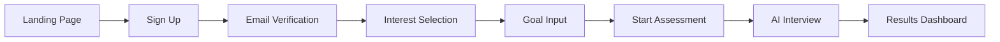
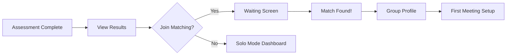
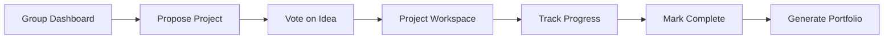

# UX/UI Design Principles & Page Flows

**Document:** TailCamp PRD - UX/UI Design Principles  
**Version:** 1.1  
**Last Updated:** 2025-11-23

---

## 1. Design Philosophy

### Clarity First
Complex functionality should be immediately understandable through intuitive design. Every interaction should have a clear purpose and predictable outcome.

### Progressive Disclosure
Present only the information needed at each step to reduce cognitive load. Advanced features are accessible but not prominent until the user needs them.

### Delightful Moments
Micro-animations and contextual feedback create moments of delight without distracting from core tasks.

### Accessibility
WCAG 2.1 AA compliance ensures that all users, regardless of ability, can access and use TailCamp effectively.

---

## 2. Detailed User Flows

### Flow 1: New User Onboarding → Assessment

**Goal:** Guide users from sign-up to completed AI assessment in <15 minutes.

**Page Breakdowns:**

#### D: Interest Selection (Multi-Select)
-   **Layout:** 3x3 grid of technology cards (Backend, Frontend, AI/ML, Mobile, DevOps, etc.)
-   **Interaction:** Click to toggle selection (checkmark animation), minimum 1, maximum 3 selections
-   **CTA:** "Continue to Goals" button (disabled until 1+ selected)

#### E: Goal Input (Free Text)
-   **Prompt:** "What do you want to achieve in the next 3 months?"
-   **Input:** Text area (150 characters minimum), suggestions appear based on selections
-   **Examples shown:** "Build a full-stack e-commerce app", "Contribute to open source"

#### F: Start Assessment
-   **Explainer:** "I'll ask you 5-7 questions to understand your current skills. It takes about 10 minutes."
-   **Privacy Note:** "Conversations are encrypted and used only for your personalized curriculum."
-   **CTA:** "Begin Interview"

---

### Flow 2: Assessment → Matching → Group Formation

**Goal:** Show transparency in matching, build trust in the algorithm.

**Page Breakdowns:**

#### B: View Assessment Results
-   **Visualization:** Radar chart showing skill scores (Backend: 0.7, Frontend: 0.3, etc.)
-   **Insights:** "You're strongest in backend development. Recommended focus: API design, databases."
-   **CTA Options:** "Find My Team" (primary), "Explore Solo" (secondary)

#### D: Matching Waiting Screen
-   **Animation:** Pulsing circles representing users in queue, AI "thinking" indicator
-   **Status Updates:** "Analyzing 47 potential teammates...", "Found 3 promising matches..."
-   **Estimated Time:** Dynamic countdown (e.g., "Usually takes 2-6 hours")
-   **Option:** "Leave Queue" button (confirmation modal to prevent accidental exits)

#### F: Match Found Celebration
-   **Confetti Animation:** Brief celebratory animation (2 seconds)
-   **Preview:** Profile cards of 3-4 matched teammates (name, avatar, top skills)
-   **Match Score:** "92% compatibility" with brief explanation ("Complementary skills, shared goal: Build a REST API")

#### G: Group Profile Page
-   **Sections:**
    -   Group Name (e.g., "Backend Builders - Cohort 42")
    -   Member cards (click to view full profile)
    -   Shared Learning Goal
    -   Suggested First Meeting agenda
-   **CTA:** "Schedule First Meeting" (integrates with calendar)

---

### Flow 3: Group → Project → Portfolio

**Goal:** Seamlessly transition from team formation to deliverable output.

**Page Breakdowns:**

#### D: Project Workspace (Central Hub)
-   **Left Sidebar:**
    -   Project Overview
    -   Tech Stack badges
    -   GitHub repo link
    -   Progress bar (0-100%)
-   **Center Canvas:**
    -   Kanban Board (To Do, In Progress, Review, Done)
    -   Drag-and-drop task cards
    -   Assignee avatars, due dates, priority labels
-   **Right Sidebar:**
    -   AI Coach widget ("Need help with authentication?" suggestions)
    -   Team chat (real-time, typing indicators)
    -   File sharing panel

#### G: Portfolio Generator
-   **Auto-populated Fields:**
    -   Project name, description
    -   Tech stack
    -   Your role & contributions (from GitHub commits)
    -   Screenshots (uploaded by team)
-   **Customization:** Edit sections, choose template (Minimal, Professional, Creative)
-   **Output:** Live preview, 1-click export to PDF or hosted web page

---

## 3. Design System

### Color Palette

| Color | Hex | Usage |
|:------|:----|:------|
| Primary Blue | `#0a95ff` | CTAs, links, primary actions |
| Secondary Green | `#22c55e` | Success states, completion indicators |
| Accent Orange | `#f97316` | Alerts, important notifications |
| Neutral Gray | `#6b7280` | Body text |
| Background | `#f9fafb` | Page background (light mode) |

### Typography

-   **Headings:** Inter, 600 weight
-   **Body:** Inter, 400 weight
-   **Code:** JetBrains Mono, 400 weight
-   **Sizes:** 12px (caption), 14px (body), 16px (default), 20px (h3), 24px (h2), 32px (h1)

### Component Library

-   **Buttons:** Primary (filled), Secondary (outlined), Ghost (text-only)
-   **Input Fields:** Text, Textarea, Select (dropdown), Multi-select (tags)
-   **Cards:** Flat (no shadow), Elevated (subtle shadow), Interactive (hover lift)
-   **Modals:** Centered overlay with backdrop blur

---

## 4. Responsive Breakpoints

| Device | Width | Layout Adjustments |
|:-------|:------|:-------------------|
| Mobile | < 768px | Single column, bottom nav, collapsible sidebar |
| Tablet | 768px - 1024px | Two-column where applicable, side nav |
| Desktop | > 1024px | Three-column layouts, persistent sidebar |

**Mobile-First Approach:** All designs start with mobile constraints, then progressively enhance for larger screens.

---

## 5. Accessibility Standards

### WCAG 2.1 AA Compliance

-   **Color Contrast:** 4.5:1 for normal text, 3:1 for large text
-   **Keyboard Navigation:** All interactive elements reachable via Tab, Enter, Esc keys
-   **Screen Reader Support:** Semantic HTML, ARIA labels for dynamic content
-   **Focus Indicators:** Visible 2px outline on all focusable elements

### Testing Tools

-   **axe DevTools:** Automated accessibility scanning
-   **NVDA/JAWS:** Manual screen reader testing
-   **Lighthouse:** Accessibility score >95

---

**Next Step:** Review [02-User-Journey-Flows](02-User-Journey-Flows.md) for detailed screen-by-screen flows.

