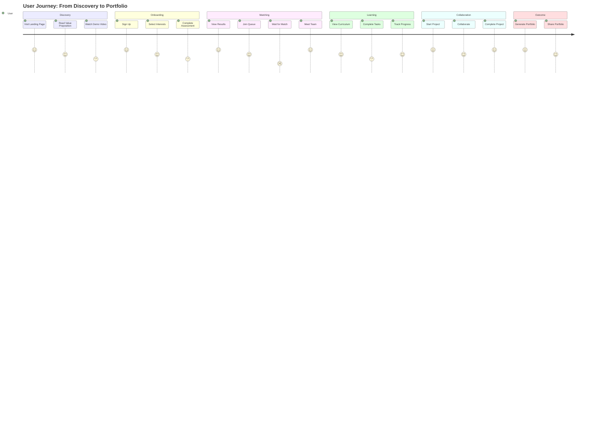

# User Journey & Detailed UX Flows

**Document:** TailCamp PRD - User Journey & Detailed UX Flows  
**Version:** 1.0  
**Last Updated:** 2025-11-23

---

## 1. Overview

This document provides comprehensive user journey maps and detailed UX flows for all major user paths in TailCamp. Each flow includes screen-by-screen breakdowns, interaction states, error handling, and edge cases.

**Related Documents:**
- [01-UX-UI-Principles](01-UX-UI-Principles.md) - Design philosophy and system
- [Features Overview](../03-features/README.md) - Feature specifications

---

## 2. User Journey Map

### 2.1 Complete User Lifecycle



---

## 3. Detailed User Flows

### Flow 1: New User Onboarding → Assessment

**User Goal:** Complete initial setup and get skill assessment  
**Success Criteria:** User completes assessment in <15 minutes  
**Drop-off Risk Points:** Email verification, Assessment start

#### 3.1.1 Landing Page → Sign Up

**Screen: Landing Page**

**Layout:**
```
┌─────────────────────────────────────────┐
│  [Logo]              [Login] [Sign Up]  │
├─────────────────────────────────────────┤
│                                         │
│         Hero Section                    │
│    "Find Your Perfect Learning Team"   │
│                                         │
│    [Watch Demo] [Get Started]          │
│                                         │
│  Features Grid (3 columns)              │
│  - AI Assessment                        │
│  - Smart Matching                       │
│  - Portfolio Builder                    │
│                                         │
│  Testimonials Carousel                  │
│  FAQ Accordion                          │
│                                         │
└─────────────────────────────────────────┘
```

**Interactions:**
- **"Get Started" Button:** Smooth scroll to sign-up form or navigate to `/signup`
- **"Watch Demo" Button:** Opens modal with embedded video (YouTube/Vimeo)
- **Scroll Behavior:** Sticky header appears after 100px scroll
- **Mobile:** Hamburger menu replaces top nav

**States:**
- **Default:** Hero section visible, CTA buttons prominent
- **Scrolled:** Header becomes sticky, reduced opacity
- **Loading:** Skeleton screens for testimonials

**Error Handling:**
- Video fails to load → Show thumbnail with "Play" button
- Network error → Retry button appears

---

#### 3.1.2 Sign Up Form

**Screen: Sign Up**

**Layout:**
```
┌─────────────────────────────────────────┐
│  [← Back]                               │
│                                         │
│  Create Your Account                    │
│                                         │
│  Email: [________________]              │
│  Name:  [________________]              │
│  Password: [________________] [👁]      │
│  Confirm:  [________________]           │
│                                         │
│  ☐ I agree to Terms & Privacy Policy   │
│                                         │
│  [Create Account]                       │
│                                         │
│  ─────────── or ───────────             │
│                                         │
│  [Continue with Google]                 │
│  [Continue with GitHub]                 │
│                                         │
└─────────────────────────────────────────┘
```

**Validation Rules:**
- **Email:** Valid email format, real-time validation
- **Password:** Min 8 chars, 1 uppercase, 1 number (show strength meter)
- **Name:** 2-50 characters, alphanumeric + spaces
- **Checkbox:** Required to proceed

**Real-time Feedback:**
- ✅ Green checkmark when field is valid
- ❌ Red error message below invalid field
- Password strength indicator (Weak/Medium/Strong)

**Error States:**
- **Email exists:** "This email is already registered. [Sign in instead]"
- **Weak password:** Show requirements checklist
- **Network error:** "Connection failed. Please try again."

**Success State:**
- Button shows loading spinner
- Success message: "Account created! Check your email."
- Auto-redirect to email verification screen after 2 seconds

---

#### 3.1.3 Email Verification

**Screen: Email Verification**

**Layout:**
```
┌─────────────────────────────────────────┐
│                                         │
│         ✉️ Check Your Email             │
│                                         │
│  We've sent a verification link to:    │
│  user@example.com                      │
│                                         │
│  Click the link in the email to        │
│  continue.                              │
│                                         │
│  [Resend Email] (disabled for 60s)     │
│                                         │
│  Didn't receive it?                    │
│  - Check spam folder                   │
│  - Verify email address                │
│                                         │
│  [Change Email Address]                 │
│                                         │
└─────────────────────────────────────────┘
```

**States:**
- **Initial:** "Resend Email" button disabled (60s countdown)
- **After 60s:** Button enabled, shows "Resend Email"
- **After resend:** Success toast: "Email sent! Check your inbox."
- **Verified:** Auto-redirect to Interest Selection

**Edge Cases:**
- User closes tab → Show "Resend" option on return
- Email bounces → Show error, allow email change
- Link expires → Show "Link expired" message, offer resend

---

#### 3.1.4 Interest Selection

**Screen: Interest Selection**

**Layout:**
```
┌─────────────────────────────────────────┐
│  [← Back]                               │
│                                         │
│  What are you interested in?           │
│  Select 1-3 areas (required)            │
│                                         │
│  ┌──────┐ ┌──────┐ ┌──────┐           │
│  │ 🔵   │ │ ⚪   │ │ ⚪   │           │
│  │Backend│ │Frontend│ │ AI/ML │           │
│  └──────┘ └──────┘ └──────┘           │
│                                         │
│  ┌──────┐ ┌──────┐ ┌──────┐           │
│  │ ⚪   │ │ ⚪   │ │ ⚪   │           │
│  │Mobile │ │DevOps│ │Data  │           │
│  └──────┘ └──────┘ └──────┘           │
│                                         │
│  Selected: Backend (1/3)                │
│                                         │
│  [Continue to Goals] (disabled)        │
│                                         │
└─────────────────────────────────────────┘
```

**Interaction Details:**
- **Card Click:** Toggle selection with checkmark animation (200ms)
- **Visual Feedback:** 
  - Selected: Blue border, checkmark icon, subtle scale (1.05x)
  - Hover: Slight elevation, cursor pointer
- **Counter:** Updates in real-time "Selected: X (1-3)"
- **Button State:** Disabled until 1+ selected, enabled when 1-3 selected

**Animation:**
- Card selection: Scale + border color transition
- Checkmark: Fade in from center
- Button: Smooth enable/disable transition

**Mobile Adaptation:**
- 2-column grid instead of 3
- Larger touch targets (min 44x44px)
- Swipeable card carousel option

---

#### 3.1.5 Goal Input

**Screen: Goal Input**

**Layout:**
```
┌─────────────────────────────────────────┐
│  [← Back]                               │
│                                         │
│  What do you want to achieve            │
│  in the next 3 months?                  │
│                                         │
│  ┌───────────────────────────────────┐ │
│  │                                    │ │
│  │  [Type your goal here...]          │ │
│  │                                    │ │
│  │                                    │ │
│  └───────────────────────────────────┘ │
│  150 characters minimum                 │
│  (0/150)                                │
│                                         │
│  💡 Examples:                           │
│  • Build a full-stack e-commerce app   │
│  • Contribute to open source projects  │
│  • Land a job as a backend developer  │
│                                         │
│  [Continue to Assessment] (disabled)   │
│                                         │
└─────────────────────────────────────────┘
```

**Interaction Details:**
- **Textarea:** Auto-expands up to 6 lines, then scrolls
- **Character Counter:** Updates in real-time, turns red if <150
- **Suggestions:** Appear below textarea based on selected interests
  - If "Backend" selected → "Build REST APIs", "Learn Node.js"
- **Validation:** 
  - Minimum 150 characters
  - Maximum 500 characters
  - Real-time validation feedback

**States:**
- **Empty:** Placeholder text, button disabled
- **Typing:** Character counter updates, suggestions appear
- **Valid:** Green checkmark, button enabled
- **Invalid:** Red border, error message, button disabled

**Error Messages:**
- "Please enter at least 150 characters to help us understand your goals."
- "Maximum 500 characters. Please summarize your goals."

---

#### 3.1.6 Assessment Introduction

**Screen: Assessment Introduction**

**Layout:**
```
┌─────────────────────────────────────────┐
│                                         │
│         🤖 AI Assessment                │
│                                         │
│  I'll ask you 5-7 questions to         │
│  understand your current skills.        │
│                                         │
│  ⏱️ Takes about 10 minutes              │
│  🔒 Conversations are encrypted         │
│  📊 Results are private to you          │
│                                         │
│  What to expect:                        │
│  • Technical knowledge questions        │
│  • Experience-based questions           │
│  • Real-time skill analysis             │
│                                         │
│  [Begin Interview]                      │
│                                         │
│  [Skip for now] (secondary, ghost)      │
│                                         │
└─────────────────────────────────────────┘
```

**States:**
- **Default:** All information visible, primary CTA prominent
- **Loading (after click):** Button shows spinner, "Starting interview..."
- **Skip:** Confirmation modal: "You can always take the assessment later. Continue without assessment?"

**Privacy Note:**
- Expandable "Learn more about privacy" section
- Explains data usage, encryption, storage

---

#### 3.1.7 AI Interview Interface

**Screen: AI Interview**

**Layout:**
```
┌─────────────────────────────────────────────────────┐
│  [← Exit]                    Progress: 3/7 (43%)   │
├──────────────────┬──────────────────────────────────┤
│                  │                                  │
│  Chat Interface  │  Real-time Analysis Panel       │
│  (Left 60%)      │  (Right 40%)                    │
│                  │                                  │
│  ┌────────────┐  │  ┌──────────────────────────┐  │
│  │ 🤖 AI      │  │  │ Skill Heatmap            │  │
│  │            │  │  │                          │  │
│  │ What's     │  │  │ Backend:    ████░░ 0.7  │  │
│  │ your       │  │  │ Frontend:   ██░░░░ 0.3  │  │
│  │ experience │  │  │ AI/ML:      █░░░░░ 0.2  │  │
│  │ with       │  │  │ Mobile:     ░░░░░░ 0.1  │  │
│  │ REST APIs? │  │  │ DevOps:     ██░░░░ 0.4  │  │
│  └────────────┘  │  └──────────────────────────┘  │
│                  │                                  │
│  ┌────────────┐  │  ┌──────────────────────────┐  │
│  │ 👤 You     │  │  │ Estimated Level          │  │
│  │            │  │  │                          │  │
│  │ I've built │  │  │ ⭐⭐⭐ Intermediate      │  │
│  │ several    │  │  │                          │  │
│  │ APIs using │  │  │ Confidence: 75%          │  │
│  │ Node.js... │  │  └──────────────────────────┘  │
│  └────────────┘  │                                  │
│                  │                                  │
│  ┌────────────┐  │                                  │
│  │ [Type...]  │  │                                  │
│  │ [Send]     │  │                                  │
│  └────────────┘  │                                  │
│                  │                                  │
└──────────────────┴──────────────────────────────────┘
```

**Interaction Details:**

**Chat Interface:**
- **Message Bubbles:** 
  - AI: Left-aligned, blue background, AI avatar
  - User: Right-aligned, gray background, user avatar
- **Typing Indicator:** "AI is thinking..." with animated dots
- **Input Field:**
  - Auto-focus on question load
  - Character limit: 1000 chars
  - "Send" button or Enter key to submit
  - Disabled while AI is processing

**Real-time Analysis Panel:**
- **Skill Heatmap:** Updates after each answer
  - Bar chart with color gradient (red → yellow → green)
  - Smooth animation (300ms) when values change
- **Estimated Level:** Updates dynamically
  - Shows current best guess with confidence %
  - Star rating visualization
- **Progress Bar:** Top of screen, shows question number

**States:**
- **Question Loading:** Typing indicator, input disabled
- **User Typing:** Input active, character counter visible
- **Submitting:** "Sending..." button state, input disabled
- **Processing:** Analysis panel animates, heatmap updates
- **Error:** Red error message, retry button

**Error Handling:**
- **Network Error:** "Connection lost. [Retry]"
- **Timeout:** "Taking longer than expected. [Continue waiting] or [Skip question]"
- **Invalid Input:** "Please provide a more detailed answer (min 20 characters)"

**Exit Handling:**
- **Exit Button:** Confirmation modal
  - "Your progress will be saved. You can resume within 24 hours."
  - Options: [Cancel] [Save & Exit] [Continue Interview]

---

#### 3.1.8 Assessment Results

**Screen: Assessment Results**

**Layout:**
```
┌─────────────────────────────────────────┐
│                                         │
│         🎉 Assessment Complete!         │
│                                         │
│  ┌───────────────────────────────────┐ │
│  │      Skill Radar Chart            │ │
│  │         (Interactive)             │ │
│  └───────────────────────────────────┘ │
│                                         │
│  Your Level: ⭐⭐⭐ Intermediate        │
│                                         │
│  💪 Strengths:                         │
│  • Backend Development (0.7)           │
│  • API Design (0.6)                    │
│                                         │
│  📚 Areas to Improve:                 │
│  • Frontend Frameworks (0.3)           │
│  • Testing (0.4)                       │
│                                         │
│  🎯 Recommended Learning Path:        │
│  Backend-Focused Full-Stack            │
│                                         │
│  [Find My Team] (primary)              │
│  [Explore Solo] (secondary)            │
│                                         │
└─────────────────────────────────────────┘
```

**Visualization Details:**
- **Radar Chart:** Interactive, hover shows exact values
- **Color Coding:** 
  - Green (0.7+): Strengths
  - Yellow (0.4-0.6): Developing
  - Red (<0.4): Needs improvement
- **Animations:** Chart draws on load (1s animation)

**CTA Options:**
- **"Find My Team":** Primary button, leads to matching queue
- **"Explore Solo":** Secondary button, leads to solo dashboard

**Mobile Adaptation:**
- Stacked layout instead of side-by-side
- Simplified chart (bar chart instead of radar)
- Swipeable cards for strengths/weaknesses

---

### Flow 2: Assessment → Matching → Group Formation

**User Goal:** Get matched with compatible teammates  
**Success Criteria:** User joins a group within 48 hours  
**Drop-off Risk Points:** Waiting screen, Match quality

#### 3.2.1 Matching Queue

**Screen: Matching Queue**

**Layout:**
```
┌─────────────────────────────────────────┐
│                                         │
│         🔍 Finding Your Team            │
│                                         │
│  ┌───────────────────────────────────┐ │
│  │                                   │ │
│  │    [Animated Pulsing Circles]     │ │
│  │    "Analyzing 47 potential       │ │
│  │     teammates..."                 │ │
│  │                                   │ │
│  └───────────────────────────────────┘ │
│                                         │
│  Queue Position: #12                    │
│  Estimated Time: 2-4 hours              │
│                                         │
│  What we're looking for:                │
│  ✓ Similar skill level                 │
│  ✓ Complementary strengths             │
│  ✓ Shared learning goals               │
│  ✓ Compatible schedules                │
│                                         │
│  [Leave Queue] (secondary)              │
│                                         │
│  💡 Tip: Keep the app open for         │
│     faster matching                    │
│                                         │
└─────────────────────────────────────────┘
```

**Animation Details:**
- **Pulsing Circles:** 3-5 circles pulsing in sequence
- **Status Updates:** Rotates through messages:
  - "Analyzing potential teammates..."
  - "Found 3 promising matches..."
  - "Calculating compatibility scores..."
- **Progress Indicator:** Subtle progress bar (not time-based, just visual)

**Real-time Updates:**
- **WebSocket Connection:** Live updates every 30 seconds
- **Queue Position:** Updates when others match or leave
- **Status Messages:** Change based on algorithm progress

**States:**
- **Waiting:** Default state, animations active
- **Matching:** "We found potential teammates! Finalizing..."
- **Matched:** Celebration animation, redirect to match screen
- **Error:** "Something went wrong. [Retry]"

**Leave Queue Flow:**
1. Click "Leave Queue"
2. Confirmation modal: "Are you sure? You'll lose your position."
3. Options: [Cancel] [Leave Queue]
4. If confirmed → Redirect to Solo Dashboard

---

#### 3.2.2 Match Found Celebration

**Screen: Match Found**

**Layout:**
```
┌─────────────────────────────────────────┐
│                                         │
│         🎊 Match Found!                 │
│                                         │
│  [Confetti Animation - 2 seconds]      │
│                                         │
│  Compatibility: 92%                     │
│  "Complementary skills, shared goal:    │
│   Build a REST API"                     │
│                                         │
│  Your Team:                             │
│  ┌──────┐ ┌──────┐ ┌──────┐          │
│  │ 👤   │ │ 👤   │ │ 👤   │          │
│  │Alex  │ │Sam   │ │Jordan│          │
│  │Backend│ │Frontend│ │Full-│          │
│  │⭐⭐⭐ │ │⭐⭐  │ │Stack │          │
│  └──────┘ └──────┘ └──────┘          │
│                                         │
│  [View Team Profile]                    │
│                                         │
└─────────────────────────────────────────┘
```

**Animation Sequence:**
1. **Confetti Burst:** 2-second celebration animation
2. **Fade In:** Team cards fade in sequentially (staggered)
3. **Compatibility Score:** Counts up from 0% to final score

**Team Card Details:**
- **Avatar:** User profile picture or initials
- **Name:** First name only (privacy)
- **Skills:** Top 2-3 skills as badges
- **Level:** Star rating
- **Click:** Opens full profile modal

**Compatibility Explanation:**
- Expandable section: "Why this match?"
- Shows matching factors:
  - Goal similarity: 95%
  - Skill complementarity: 88%
  - Schedule overlap: 90%

---

#### 3.2.3 Group Profile Page

**Screen: Group Profile**

**Layout:**
```
┌─────────────────────────────────────────┐
│  [← Back]              [Settings ⚙️]    │
├─────────────────────────────────────────┤
│                                         │
│  Backend Builders - Cohort 42           │
│  👥 4 members  |  🎯 Active            │
│                                         │
│  ┌───────────────────────────────────┐ │
│  │ Team Members                      │ │
│  │                                   │ │
│  │  [Card] [Card] [Card] [Card]     │ │
│  │  (Click to view profile)          │ │
│  └───────────────────────────────────┘ │
│                                         │
│  Shared Learning Goal:                  │
│  "Build a full-stack e-commerce app"   │
│                                         │
│  Suggested First Meeting:               │
│  📅 This Saturday, 2 PM                │
│  💬 Icebreaker: "What's your            │
│     favorite programming language?"    │
│                                         │
│  [Schedule First Meeting]               │
│  [Start Project]                        │
│                                         │
│  ┌───────────────────────────────────┐ │
│  │ Group Charter                     │ │
│  │                                   │ │
│  │  ✓ We commit to daily updates    │ │
│  │  ✓ We respect each other's time  │ │
│  │  ✓ We celebrate small wins       │ │
│  │                                   │ │
│  │  [Edit Charter]                  │ │
│  └───────────────────────────────────┘ │
│                                         │
└─────────────────────────────────────────┘
```

**Member Card Details:**
- **Hover State:** Slight elevation, shows "View Profile" tooltip
- **Click:** Modal with full profile:
  - Assessment results (if shared)
  - Previous projects
  - Availability
  - Contact info (if opted in)

**Group Charter:**
- **Purpose:** Set expectations and norms
- **Default Items:** Pre-filled suggestions
- **Editable:** All members can suggest changes
- **Voting:** Changes require majority approval

**First Meeting Setup:**
- **Calendar Integration:** Click opens calendar picker
- **Time Suggestions:** Based on member availability
- **Icebreaker:** AI-generated question to break the ice
- **Meeting Link:** Auto-generates Zoom/Google Meet link

---

### Flow 3: Group → Project → Portfolio

**User Goal:** Complete a collaborative project and generate portfolio  
**Success Criteria:** Project completed, portfolio generated  
**Drop-off Risk Points:** Project planning, Mid-project abandonment

#### 3.3.1 Project Proposal

**Screen: Project Proposal**

**Layout:**
```
┌─────────────────────────────────────────┐
│  [← Back to Group]                      │
├─────────────────────────────────────────┤
│                                         │
│  Propose a Project                      │
│                                         │
│  Project Name:                          │
│  [_____________________________]        │
│                                         │
│  Description:                           │
│  ┌───────────────────────────────────┐ │
│  │                                   │ │
│  │  [Describe your project idea...] │ │
│  │                                   │ │
│  └───────────────────────────────────┘ │
│                                         │
│  Tech Stack (select multiple):          │
│  [Node.js] [React] [PostgreSQL] [+]    │
│                                         │
│  Estimated Duration:                    │
│  ○ 2 weeks  ○ 1 month  ● 2-3 months   │
│                                         │
│  Difficulty Level:                      │
│  ○ Beginner  ● Intermediate  ○ Advanced│
│                                         │
│  [Propose Project]                      │
│                                         │
└─────────────────────────────────────────┘
```

**Interaction Details:**
- **Tech Stack:** Multi-select chips, searchable dropdown
- **Duration:** Radio buttons with visual timeline
- **Difficulty:** Radio buttons with descriptions
- **Validation:** All fields required before submission

**AI Suggestions:**
- **"Need ideas?" Button:** Opens AI project generator
  - Input: "I want to build something with React and Node.js"
  - Output: 3 project suggestions with descriptions

---

#### 3.3.2 Project Voting

**Screen: Project Voting**

**Layout:**
```
┌─────────────────────────────────────────┐
│  [← Back]                               │
├─────────────────────────────────────────┤
│                                         │
│  Vote on Project Ideas                  │
│                                         │
│  ┌───────────────────────────────────┐ │
│  │ Project: E-commerce API            │ │
│  │ By: Alex                           │ │
│  │                                    │ │
│  │ "Build a RESTful API for an       │ │
│  │  e-commerce platform with..."     │ │
│  │                                    │ │
│  │ Tech: Node.js, PostgreSQL         │
│  │ Duration: 2-3 months              │
│  │                                    │ │
│  │ 👍 3 votes  |  💬 2 comments     │
│  │                                    │ │
│  │ [👍 Vote] [💬 Comment]           │ │
│  └───────────────────────────────────┘ │
│                                         │
│  ┌───────────────────────────────────┐ │
│  │ Project: Task Management App      │ │
│  │ ...                               │ │
│  └───────────────────────────────────┘ │
│                                         │
│  Voting ends in 48 hours                │
│                                         │
└─────────────────────────────────────────┘
```

**Voting Mechanism:**
- **Upvote Only:** Simple 👍 button (no downvotes)
- **Multiple Votes:** Users can vote for multiple projects
- **Vote Count:** Real-time updates via WebSocket
- **Winning Project:** Highest votes after 48 hours

**Comment System:**
- **Inline Comments:** Expandable section below each project
- **Real-time:** New comments appear instantly
- **Notifications:** Alert when someone comments on your proposal

---

#### 3.3.3 Project Workspace

**Screen: Project Workspace**

**Layout:**
```
┌─────────────────────────────────────────────────────────┐
│  [← Back]  E-commerce API  [Settings]  [Members 👥]     │
├──────────┬──────────────────────────────┬────────────────┤
│          │                              │                │
│ Left     │  Center Canvas              │  Right         │
│ Sidebar  │  (Kanban Board)             │  Sidebar       │
│ (20%)    │  (60%)                      │  (20%)         │
│          │                              │                │
│ Project  │  ┌──────┐ ┌──────┐ ┌──────┐│  AI Coach      │
│ Overview │  │ To Do│ │In Pro│ │ Done ││  ┌──────────┐  │
│          │  │      │ │gress │ │      ││  │💬 Need   │  │
│ Tech:    │  │[Card]│ │[Card]│ │[Card]││  │help with │  │
│ • Node   │  │[Card]│ │[Card]│ │[Card]││  │auth?     │  │
│ • PG     │  │      │ │      │ │      ││  └──────────┘  │
│          │  └──────┘ └──────┘ └──────┘│                │
│ Progress │                              │  Team Chat     │
│ ████░░░░ │  [Drag cards between columns]│  ┌──────────┐  │
│ 40%      │                              │  │💬 Alex:  │  │
│          │                              │  │"PR ready"│  │
│ GitHub   │                              │  │          │  │
│ [Link]   │                              │  │[Type...] │  │
│          │                              │  └──────────┘  │
│          │                              │                │
│          │                              │  File Sharing  │
│          │                              │  ┌──────────┐  │
│          │                              │  │📄 design │  │
│          │                              │  │📄 schema │  │
│          │                              │  │[Upload]  │  │
│          │                              │  └──────────┘  │
└──────────┴──────────────────────────────┴────────────────┘
```

**Kanban Board Details:**

**Task Card:**
```
┌─────────────────────┐
│ Implement Auth      │
│                     │
│ Assignee: @Alex     │
│ Priority: High 🔴  │
│ Due: Dec 25         │
│                     │
│ [View Details]      │
└─────────────────────┘
```

**Interactions:**
- **Drag & Drop:** Cards can be dragged between columns
- **Card Click:** Opens task detail modal
- **Quick Actions:** Hover shows "Assign", "Set Due Date", "Delete"

**AI Coach Widget:**
- **Context-Aware:** Analyzes current project state
- **Suggestions:** 
  - "Need help with authentication? [Get help]"
  - "Your team hasn't committed in 2 days. [Send reminder]"
- **Click:** Opens AI chat interface

**Team Chat:**
- **Real-time:** WebSocket-based, instant delivery
- **Typing Indicators:** Shows "Alex is typing..."
- **File Sharing:** Drag & drop or click to upload
- **Mentions:** @username to notify specific members

**States:**
- **Loading:** Skeleton screens for all sections
- **Offline:** "Reconnecting..." banner, queue messages
- **Error:** Red error message, retry button

---

#### 3.3.4 Portfolio Generator

**Screen: Portfolio Generator**

**Layout:**
```
┌─────────────────────────────────────────┐
│  [← Back]                               │
├─────────────────────────────────────────┤
│                                         │
│  Generate Your Portfolio                │
│                                         │
│  Select Projects:                       │
│  ☑ E-commerce API (Completed)          │
│  ☑ Task Management App (Completed)     │
│  ☐ Learning Dashboard (In Progress)    │
│                                         │
│  Choose Template:                       │
│  ┌──────┐ ┌──────┐ ┌──────┐          │
│  │Minimal│ │Professional│ │Creative│  │
│  │  ●   │ │      │ │      │          │
│  └──────┘ └──────┘ └──────┘          │
│                                         │
│  Preview:                               │
│  ┌───────────────────────────────────┐ │
│  │                                   │ │
│  │  [Live Preview of Portfolio]      │ │
│  │                                   │ │
│  └───────────────────────────────────┘ │
│                                         │
│  [Generate Portfolio]                   │
│                                         │
└─────────────────────────────────────────┘
```

**Template Selection:**
- **Minimal:** Clean, text-focused, single column
- **Professional:** Corporate style, two columns, formal
- **Creative:** Colorful, modern, interactive elements

**Auto-populated Content:**
- **Project Name:** From project data
- **Description:** AI-generated from project description + commits
- **Tech Stack:** Extracted from project tech_stack field
- **Contributions:** Analyzed from GitHub commits
- **Screenshots:** User-uploaded images

**Generation Process:**
1. Click "Generate Portfolio"
2. Loading screen: "Analyzing your projects... (1/3)"
3. "Generating content... (2/3)"
4. "Creating portfolio... (3/3)"
5. Success: "Portfolio ready! [View] [Export]"

**Export Options:**
- **PDF:** High-resolution, print-ready
- **Web:** Hosted URL (e.g., `username.tailcamp.io/portfolio`)
- **Share:** Social media sharing buttons

---

## 4. Error States & Edge Cases

### 4.1 Network Errors

**Scenario:** User loses internet connection during assessment

**Flow:**
1. Show "Connection lost" banner at top
2. Auto-retry every 5 seconds
3. If retry fails after 3 attempts:
   - Show "Offline mode" message
   - Save progress locally
   - "Resume when online" button
4. When reconnected:
   - Auto-sync saved progress
   - Show "Synced!" confirmation

### 4.2 Empty States

**Empty Project List:**
```
┌─────────────────────────────────────────┐
│                                         │
│         📭 No Projects Yet             │
│                                         │
│  Start your first project with          │
│  your team!                             │
│                                         │
│  [Propose a Project]                    │
│                                         │
└─────────────────────────────────────────┘
```

**Empty Task Board:**
```
┌─────────────────────────────────────────┐
│                                         │
│         📋 No Tasks Yet                 │
│                                         │
│  Break down your project into           │
│  manageable tasks.                       │
│                                         │
│  [Create First Task]                    │
│                                         │
└─────────────────────────────────────────┘
```

### 4.3 Loading States

**Skeleton Screens:**
- Dashboard: Animated gray boxes matching content layout
- Cards: Pulsing gray rectangles
- Lists: Animated lines

**Progress Indicators:**
- **Spinner:** For actions <3 seconds
- **Progress Bar:** For actions >3 seconds with known duration
- **Percentage:** For actions with calculable progress

---

## 5. Mobile Adaptations

### 5.1 Navigation

**Desktop:** Top navigation bar, persistent sidebar  
**Mobile:** Bottom tab bar, hamburger menu for secondary actions

**Bottom Tab Bar:**
```
┌─────────────────────────────────────────┐
│                                         │
│              [Content]                  │
│                                         │
├─────────────────────────────────────────┤
│  🏠  📚  👥  📊  👤                    │
│ Home Learn Team Progress Profile        │
└─────────────────────────────────────────┘
```

### 5.2 Layout Adjustments

**Assessment Screen:**
- **Desktop:** Split view (chat + analysis)
- **Mobile:** Full-screen chat, swipe to view analysis panel

**Project Workspace:**
- **Desktop:** Three-column layout
- **Mobile:** Tab-based navigation between Kanban, Chat, Files

### 5.3 Touch Interactions

- **Swipe Gestures:** 
  - Swipe left on task card → Quick actions menu
  - Swipe right → Mark complete
- **Long Press:** Context menu
- **Pull to Refresh:** Update data

---

## 6. Accessibility Considerations

### 6.1 Keyboard Navigation

**Tab Order:**
1. Primary CTA
2. Form fields (top to bottom)
3. Secondary actions
4. Navigation links

**Keyboard Shortcuts:**
- `Esc`: Close modal/overlay
- `Enter`: Submit form
- `Tab`: Next field
- `Shift+Tab`: Previous field

### 6.2 Screen Reader Support

**ARIA Labels:**
- All interactive elements have descriptive labels
- Status updates announced: "Assessment complete. Your level is Intermediate."
- Progress updates: "Question 3 of 7"

**Semantic HTML:**
- Proper heading hierarchy (h1 → h2 → h3)
- Form labels associated with inputs
- Button roles for custom elements

### 6.3 Visual Accessibility

**Color Contrast:**
- All text meets WCAG AA (4.5:1)
- Focus indicators: 2px blue outline
- Error states: Red text + icon (not color alone)

**Text Alternatives:**
- All icons have text labels or aria-labels
- Images have alt text
- Charts have data tables as fallback

---

## 7. Animation Guidelines

### 7.1 Micro-interactions

**Button Hover:**
- Scale: 1.02x
- Duration: 150ms
- Easing: ease-out

**Card Selection:**
- Scale: 1.05x
- Border color transition: 200ms
- Shadow elevation: 300ms

**Toast Notifications:**
- Slide in from top: 300ms
- Auto-dismiss: 3 seconds
- Slide out: 200ms

### 7.2 Page Transitions

**Route Changes:**
- Fade: 200ms
- Slide (mobile): 300ms
- No transition for instant actions (button clicks)

**Modal Open/Close:**
- Backdrop fade: 200ms
- Modal scale + fade: 250ms
- Easing: cubic-bezier(0.4, 0, 0.2, 1)

---

## 8. Performance Targets

### 8.1 Load Times

- **First Contentful Paint:** < 1.5s
- **Time to Interactive:** < 3.5s
- **Largest Contentful Paint:** < 2.5s

### 8.2 Interaction Response

- **Button Click:** < 100ms visual feedback
- **Form Submission:** < 500ms loading state
- **API Response:** < 2s for 95% of requests

### 8.3 Optimization Strategies

- **Code Splitting:** Route-based chunks
- **Image Optimization:** WebP format, lazy loading
- **Caching:** Service worker for offline support
- **Prefetching:** Next route prefetch on hover

---

## 9. Related Documents

- [01-UX-UI-Principles](01-UX-UI-Principles.md) - Design system and philosophy
- [Features Overview](../03-features/README.md) - Feature specifications
- [System Architecture](../04-architecture/system-architecture.md) - Technical implementation

---

**Next Step:** Review [01-UX-UI-Principles](01-UX-UI-Principles.md) for design system details.

